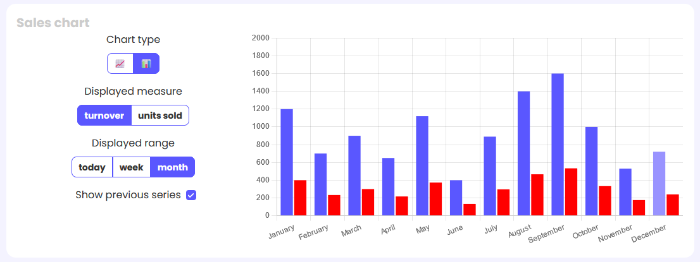

# Hello 👋

My name is **Piotr Wiśniewski**  
I'm currently studying **Applied Computer Science** at Warsaw University of Technology

---

## Technologies I know:

- TypeScript 📡
- HTML 🧩
- CSS 🎨

## I am currently learning:

🌱 **Angular**

## My projects

  
<b>Click to see</b>

    

- Movie app - https://github.com/Pioter17/PAMiW---Projekt  
  Application for CRUD operations with user authentication and request access protected with JWT. Other features: theme/language changing, roles on backend. More details in project's README.md file. 
  Technologies: Angular, Typescript, Java, Spring, JWT, Bootstrap, Blazor.
   

- Notes app - https://github.com/Pioter17/ODAS---Projekt  
  Application for writing notes with some basic styling and saving them in the secured backend. Features: two factor authentication, writing public/private notes (private are protected with additional password), several safeguards, password strength check & other. Application is dockerized. More details in project's README.md file. 
  Technologies: Angular, Typescript, Java, Spring, JWT, Docker, Google Authenticator.

- Board games store app - https://github.com/Pioter17/Planszowo  
  Angular application for fictional board games store. It allows users to browse available games, use search filter, add products to cart, delete products from cart and fill in the order form. Board games are also fictional due to closure of the API I originally used. More details in project's README.md file. 
  Technologies: Angular, Typescript, Material.  
  App is available here: https://planszowo.vercel.app/home

- Games app - https://github.com/Pioter17/Projekt_dyplomowy  
  **(In development)**  
  Angular application with some logic/arcade games written in Typescript. For now there are: Minesweeper, Memory, Whack-a-mole and Mastermind. The main focus is on the visual part of the project.  
  Technologies: Angular, Typescript, Material.

- Hotel app - https://github.com/Pioter17/Hotel  
  **(In development)**  
  Angular application for fictional hotel. It will feature user accounts, apartment reservations stored in database, and different views for user logged as admin (with ability to make some changes to the website).  
  Technologies: Angular, Typescript, Material, Firebase.

## Projects in which I participated:

  
<b>Click to see</b>

     

- Salesman dashboard: https://github.com/sterenczakdawid/pgui-projekt  
  Final project for one of university classes. It was made in pairs using React. I did about half of the project. Application consists of user login, displaying different data based on different shop picked, and theme/language changing. We also used Figma to design layout and Enterprise Architect to make UML diagrams. For styles we used Tailwind. 
  Technologies: React, Typescript, Redux, Tailwind, Figma, UML.  
  App is available here: https://react-sales-dashboard.netlify.app/

  

    
<b>Click to see short summary and images</b>

     

    Login page 
    
     

    Dashboard page
    
    
     

    Changing theme
    
     

    Changing language
    

    Different chart display options
    
    
  

   

- LoLMatch app: https://github.com/LoLMatch  
  Group project for one of college classes. Our project is an application for finding teammates to play League of Legends. It uses mechanisms similar to dating apps to match people based on their stats and preferences. We also offer a module to find teams, schedule meetings and chat with people. The entire team consists of 10 people, and 3 of us (including me) are managing the frontend part.  
  Technologies: Angular, Typescript, Material, Websockets, Java, Spring, Python, Docker, Keycloak, Figma, Jira.  

  

    
<b>Click to see the parts I made</b>

     
    These images are from browser on desktop, but all views of application have their layout for phones too.  

    Landing page  
    
      

    Post registration form - it sends the data to the backend. This information is needed for the matching module.
    
      
    
      
    
      
    
      

    Dashboard page - displays overall user info. 
    
      

    Topbar and sidebar - link to different parts of application.
    
      
    
      

    Chat - the biggest part I made. It uses websockets for connection with backend. Everything is updated immediately. It also features group chat.
    
      
    
      
    Phone view of chat with user  
    
      
    Contacts filter  
    
      
    Account page - fetches data from backend and allows user to change some part of it.
    
      
    
      
    
      
  

